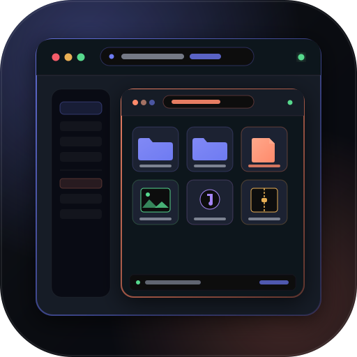

<!-- v1.0.0 -->
# browser-browser

<div align="center">
  
  <p><strong>A hardware-grade local files browser inside your web browser.</strong></p>
  <p>Transforms native Firefox directory browsing (<code>file:///</code>) and provides a dedicated file workspace styled with the <em>vaultwares²</em> (<code>vaultsqware</code>) <strong>Obsidian & Iris</strong> design system.</p>
</div>

---

## Highlights & Features

- 🛸 **Dual Mode Operation**:
  - **In-Place Transformation**: Automatically transforms Firefox's raw default directory table on any `file:///` page into an interactive, sleek VaultSqwares interface.
  - **Dedicated Full-Tab Workspace**: Open `manager.html` via toolbar action or `Alt+Shift+B` for a standalone workspace with folder selection, tabbed navigation, and dropzone support.
- 🎨 **VaultSqwares Design System ("Obsidian & Iris")**:
  - Main operational console (`.vwsq-console-shell`) in obsidian (`#0a0c11`) with iris (`#6e7bf2`) and coral (`#ff8a6b`) accents.
  - Navigation Warm-Rail (`.vwsq-warm-rail`) in bone paper (`#edece8`) for side navigation, pinned bookmarks, and quick filters.
  - Hardware status LEDs (`.vwsq-led--live`) providing subtle ambient state.
- 👁️ **Multi-Format Instant Previews & Quick Look**:
  - **Spacebar Quick Look**: Instant modal inspection without navigating away.
  - **Images**: High-res rendering with zoom, resolution badge, and metadata (PNG, JPG, WebP, SVG, GIF, AVIF, BMP).
  - **Audio**: Custom interactive audio player with waveform controls, play/pause, and time scrubbing (MP3, WAV, FLAC, OGG, M4A).
  - **Video**: Responsive video player with frame scrubber (MP4, WebM, MKV, MOV).
  - **Source Code**: Syntax-highlighted code viewer with line numbers for 30+ languages (JS, TS, Python, Rust, Go, HTML, CSS, SQL, Shell, C/C++).
  - **Markdown**: Formatted GFM renderer with headings, checklists, code blocks, and blockquotes.
  - **JSON**: Formatted tree view.
  - **PDF & Plain Text**: Direct inline rendering.
- 🗂️ **Multi-Layout Views & Sorting**:
  - Grid Thumbnail cards with live previews.
  - Detailed Sortable Table (Sort by Name, Size, Date Modified, Type).
  - Compact scanning list.
- ⚡ **Lightning Fast Search & Filter**:
  - Real-time instant search bar (`/` hotkey).
  - Category filters: All, Folders, Images, Audio, Video, Source Code, Archives.
- 📌 **Bookmarks & Windows Drives**:
  - One-click drive switcher (`C:`, `D:`, `E:`, `Z:`).
  - Pinned directory bookmarks persisted in `browser.storage.local`.
- 🔌 **Python-Zipper Daemon Integration**:
  - Real-time connection to local Python-Zipper background server (`http://127.0.0.1:5171` / `vaultwares-api`).
  - Live pulse indicator in top header with ping latency.
  - One-click actions: "Send to Python-Zipper", "Scrape & Zip", and batch download manager.
- ⌨️ **Comprehensive Keyboard Navigation**:
  - Navigate files with `Arrow Keys` or `j` / `k`.
  - Open selected folder or inspect file with `Enter`.
  - Go to parent folder with `Backspace`.
  - Quick Look with `Space`.
  - Focus search with `/`.
  - Cycle view layouts with `v`.
  - Toggle bookmark with `b`.
  - Refresh with `r`.

---

## Project Structure

```
browser-browser/
├── .git/
├── .gitmodules                       # Git submodule tracking vaultwares-themes
├── .gitignore
├── manifest.json                     # Firefox WebExtension Manifest V3
├── README.md                         # Documentation
├── CHANGES.md                        # Changelog
├── vaultwares-themes/                # Git Submodule (vaultwares-themes/vaultsqware)
├── assets/
│   ├── logo.svg                      # Master vector brand logo
│   ├── favicon.svg                   # Extension favicon
│   ├── icon-16.svg / icon-32.svg / icon-48.svg / icon-128.svg
│   └── icons/                        # File type and interface vector SVGs
├── src/
│   ├── common/
│   │   ├── theme.css                 # VaultSqwares theme bridge & custom extension styles
│   │   ├── utils.js                  # Byte sizing, date formatters, MIME resolvers, clipboard
│   │   ├── storage.js                # browser.storage.local wrapper (pins, history, settings)
│   │   ├── icons.js                  # Crisp vector icon registry
│   │   └── keybindings.js            # Global hotkey and arrow navigation controller
│   ├── content/
│   │   ├── content.js                # Content script entrypoint
│   │   ├── parser.js                 # Firefox native file:/// directory table parser
│   │   ├── injector.js               # DOM overlay and VaultSqwares UI mounting controller
│   │   └── content.css               # Content script overlay stylesheet
│   ├── app/
│   │   ├── manager.html              # Dedicated full-tab File Manager application
│   │   ├── manager.js                # Main application workspace controller
│   │   ├── manager.css               # Dedicated workspace stylesheet
│   │   └── components/
│   │       ├── navbar.js             # Top navigation bar with breadcrumbs & search
│   │       ├── sidebar.js            # Warm Rail sidebar (drives, bookmarks, filters)
│   │       ├── fileGrid.js           # Grid thumbnail cards view
│   │       ├── fileTable.js          # Detailed sortable table view
│   │       ├── fileList.js           # Compact scanning list view
│   │       ├── previewModal.js       # Spacebar Quick Look modal inspector
│   │       ├── audioPlayer.js        # Interactive audio player
│   │       ├── codeViewer.js         # Syntax-highlighted code viewer
│   │       ├── markdownViewer.js     # GFM markdown renderer
│   │       └── zipperWidget.js       # Python-Zipper live status widget & actions
│   ├── popup/
│   │   ├── popup.html                # Browser toolbar action popup
│   │   ├── popup.js                  # Quick drive launcher & zipper monitor
│   │   └── popup.css
│   ├── options/
│   │   ├── options.html              # Extension preferences page
│   │   ├── options.js                # Options controller (zipper endpoint, view defaults)
│   │   └── options.css
│   ├── background/
│   │   └── background.js             # Background script (context menus & tab management)
│   └── services/
│       └── pythonZipperClient.js     # Python-Zipper daemon API client (health, ping, queue)
└── scripts/
    └── package.ps1                   # Automated extension zip/xpi packaging script
```

---

## Installation & Setup in Firefox

### 1. Temporary Loading (Development & Testing)

1. Open Firefox and navigate to:
   ```
   about:debugging#/runtime/this-firefox
   ```
2. Click **"Load Temporary Add-on…"**.
3. Select the `manifest.json` file inside `c:\Users\Administrator\Desktop\Github Repos\browser-browser\manifest.json`.
4. The extension is now active! Navigate to any local directory such as:
   ```
   file:///C:/Users/Administrator/Desktop/
   ```
   or click the extension toolbar icon to open the dedicated workspace.

### 2. Packaging for Distribution (.xpi / .zip)

Run the included PowerShell packaging script:

```powershell
powershell.exe -ExecutionPolicy Bypass -File ".\scripts\package.ps1"
```

The output packages will be created in `dist/`:
- `dist/browser-browser-1.0.0.zip`
- `dist/browser-browser-1.0.0.xpi`

---

## Keyboard Shortcuts

| Shortcut | Action |
|---|---|
| <kbd>Space</kbd> | Toggle Quick Look / Preview Modal for selected file |
| <kbd>↓</kbd> / <kbd>j</kbd> | Move selection down / next item |
| <kbd>↑</kbd> / <kbd>k</kbd> | Move selection up / previous item |
| <kbd>Enter</kbd> | Open selected folder or preview selected file |
| <kbd>Backspace</kbd> | Go to parent directory |
| <kbd>/</kbd> | Focus instant search bar |
| <kbd>v</kbd> | Cycle view layouts (Grid → Table → List) |
| <kbd>b</kbd> | Pin / bookmark current folder |
| <kbd>r</kbd> | Refresh current directory |
| <kbd>Esc</kbd> | Close preview modal / clear search |

---

## Python-Zipper Integration

`browser-browser` communicates directly with the local `python-zipper` background daemon (default: `http://127.0.0.1:5171`):

- **Health Checks (`GET /health`)**: Live status indicator in the top header continuously monitors daemon connectivity and reports roundtrip ping latency in milliseconds.
- **Queue Downloads (`POST /download`)**: Send any selected file path or URL to Python-Zipper for automated archiving and processing.
- **Scrape & Zip (`POST /scrape`)**: Send web galleries or directory links directly to Python-Zipper's scraper engine.
- **Configurable Endpoint**: Adjust endpoint in **Settings** (`options.html`) to point to remote `vaultwares-api` instances or custom ports.

---

## Design System

Styled with the official `vaultwares-themes/vaultsqware` palette ("Obsidian & Iris"):
- Dual region harmony: **Console** (`.vwsq-console-shell`) and **Warm Rail** (`.vwsq-warm-rail`).
- Hardware LED signals (`.vwsq-led`):
  - Online / Exit 0: `#56d98d`
  - Alert / Non-zero: `#f45d6b`
  - Syncing / Background: `#a585f5`
  - Warning: `#e9b054`
